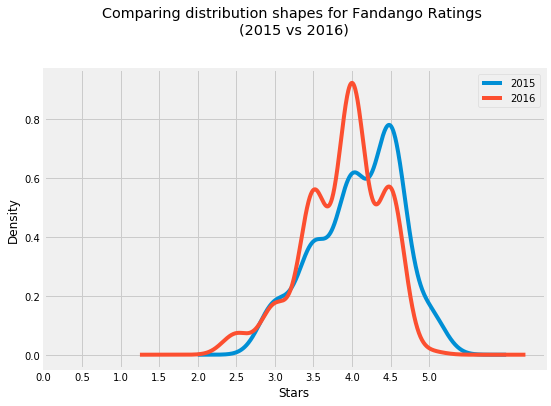
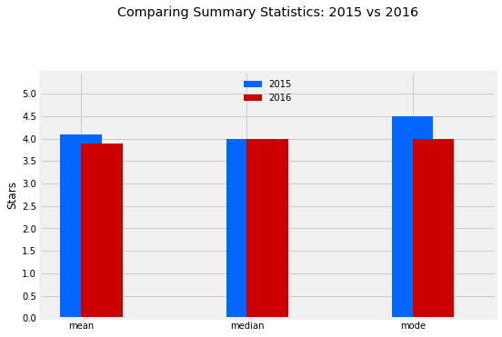

# Investigating Fandango Movie Ratings with Python using Pandas
#### Daniel Torres - Updated 9/18/2020

#### [LinkedIn](https://www.linkedin.com/in/danielrichardtorres/) | [GitHub](https://github.com/danielrichardtorres) | [Back to Portfolio](https://danieltorres.tech)

---

## Introduction
### About
I completed this guided project by dataquest.io for a course on sampling, variables, scales of measurement, and frequency distributions. I hope to demonstrate my python skills through an investigation of fandango movie ratings.

#### Background
Previously a data journalist, Walt Hickey, found that Fandango's average ratings were rounded up from the ratings users gave. This led him to conduct and investigation that can be found [here](https://fivethirtyeight.com/features/fandango-movies-ratings/). 

The result of his investigation can be seen below. Essentially, Hickey found that they were in fact rounding up.

 
Credit: [Walt Hickey from FiveThirtyEight](https://fivethirtyeight.com/contributors/walt-hickey/)

### Goal
I hope to continue this investigation here. Looking at more recent movie ratings data to see if Fandango has changed their system. Specifically:
> Determine whether there has been any change in Fandango's rating system after Hickey's analysis.

### Approach 
I will use python and pandas to review data Hickey found as well as newer data and compare.

## Important Results
In the end, I wasn't able to determine if fandango had changed their system. However, by changing my goal I was able to find a difference in the 2015 vs 2016 ratings on fandango.

We saw that in 2016 there was a drop in the mean and mode ratings for popular movies on Fandango.

##### Acknowledgements 
This project outline was provided by [dataquest.io](https://github.com/dataquestio/solutions) as a guided project.

# Take a look at the Data


```python
import pandas as pd

#reading in data
fandango_previous = pd.read_csv('fandango_score_comparison.csv')
fandango_after = pd.read_csv('movie_ratings_16_17.csv')
```


```python
#isolating just the columns with info we need 
#for Hickey's Data we'll need  'FILM', 'Fandango_Stars', 
#'Fandango_Ratingvalue', 'Fandango_votes', 'Fandango_Difference'

#for Dataquests data (the newer stuff) we'll need 'movie', 'year', 'fandango'
fandango_previous = fandango_previous[['FILM', 'Fandango_Stars', 'Fandango_Ratingvalue', 'Fandango_votes', 'Fandango_Difference']]
fandango_after = fandango_after[['movie', 'year', 'fandango']]
```


```python
fandango_previous.head()
```


<div>
<style scoped>
    .dataframe tbody tr th:only-of-type {
        vertical-align: middle;
    }

    .dataframe tbody tr th {
        vertical-align: top;
    }

    .dataframe thead th {
        text-align: right;
    }
</style>
<table border="1" class="dataframe">
  <thead>
    <tr style="text-align: right;">
      <th></th>
      <th>FILM</th>
      <th>Fandango_Stars</th>
      <th>Fandango_Ratingvalue</th>
      <th>Fandango_votes</th>
      <th>Fandango_Difference</th>
    </tr>
  </thead>
  <tbody>
    <tr>
      <th>0</th>
      <td>Avengers: Age of Ultron (2015)</td>
      <td>5.0</td>
      <td>4.5</td>
      <td>14846</td>
      <td>0.5</td>
    </tr>
    <tr>
      <th>1</th>
      <td>Cinderella (2015)</td>
      <td>5.0</td>
      <td>4.5</td>
      <td>12640</td>
      <td>0.5</td>
    </tr>
    <tr>
      <th>2</th>
      <td>Ant-Man (2015)</td>
      <td>5.0</td>
      <td>4.5</td>
      <td>12055</td>
      <td>0.5</td>
    </tr>
    <tr>
      <th>3</th>
      <td>Do You Believe? (2015)</td>
      <td>5.0</td>
      <td>4.5</td>
      <td>1793</td>
      <td>0.5</td>
    </tr>
    <tr>
      <th>4</th>
      <td>Hot Tub Time Machine 2 (2015)</td>
      <td>3.5</td>
      <td>3.0</td>
      <td>1021</td>
      <td>0.5</td>
    </tr>
  </tbody>
</table>
</div>


```python
fandango_after.head()
```


<div>
<style scoped>
    .dataframe tbody tr th:only-of-type {
        vertical-align: middle;
    }

    .dataframe tbody tr th {
        vertical-align: top;
    }

    .dataframe thead th {
        text-align: right;
    }
</style>
<table border="1" class="dataframe">
  <thead>
    <tr style="text-align: right;">
      <th></th>
      <th>movie</th>
      <th>year</th>
      <th>fandango</th>
    </tr>
  </thead>
  <tbody>
    <tr>
      <th>0</th>
      <td>10 Cloverfield Lane</td>
      <td>2016</td>
      <td>3.5</td>
    </tr>
    <tr>
      <th>1</th>
      <td>13 Hours</td>
      <td>2016</td>
      <td>4.5</td>
    </tr>
    <tr>
      <th>2</th>
      <td>A Cure for Wellness</td>
      <td>2016</td>
      <td>3.0</td>
    </tr>
    <tr>
      <th>3</th>
      <td>A Dog's Purpose</td>
      <td>2017</td>
      <td>4.5</td>
    </tr>
    <tr>
      <th>4</th>
      <td>A Hologram for the King</td>
      <td>2016</td>
      <td>3.0</td>
    </tr>
  </tbody>
</table>
</div>


# Understanding the Data

The population we're trying to understand is the **Fandango Ratings Averages For all Movies on the Site** 

From the README.md information on each data [Newer Data](https://github.com/mircealex/Movie_ratings_2016_17/blob/master/README.md) and [Hickey's Data](https://github.com/fivethirtyeight/data/blob/master/fandango/README.md) we can see that the data had certain criteria that makes it not representative or randomly sampled. 

For example in the fandango_previous a movie must:
- have had tickets on sale 
- have had at least 30 reviews on the site

The newer data set dataset is similar, but may not be representative of Fandango's process as a whole.

# Changing our Goal

Original Goal: " determine whether there has been any change in Fandango's rating system after Hickey's analysis."

New Goal: " whether there's any difference between Fandango's ratings for popular movies in 2015 and Fandango's ratings for popular movies in 2016"


Popular Definition: having 30+ fan ratings on Fandango's website

With the new goal, we now have two populations that we want to describe and compare with each other:

- All Fandango's ratings for popular movies released in 2015.
- All Fandango's ratings for popular movies released in 2016.


# Cleaning the Data - Getting Samples of our Populations
What I need now is to make sure I have the samples of the population I care about. So I need to make sure the data I use contains __popular movies__ for 2015 and 2016.


```python
fandango_after.sample(10, random_state = 1)
```


<div>
<style scoped>
    .dataframe tbody tr th:only-of-type {
        vertical-align: middle;
    }

    .dataframe tbody tr th {
        vertical-align: top;
    }

    .dataframe thead th {
        text-align: right;
    }
</style>
<table border="1" class="dataframe">
  <thead>
    <tr style="text-align: right;">
      <th></th>
      <th>movie</th>
      <th>year</th>
      <th>fandango</th>
    </tr>
  </thead>
  <tbody>
    <tr>
      <th>108</th>
      <td>Mechanic: Resurrection</td>
      <td>2016</td>
      <td>4.0</td>
    </tr>
    <tr>
      <th>206</th>
      <td>Warcraft</td>
      <td>2016</td>
      <td>4.0</td>
    </tr>
    <tr>
      <th>106</th>
      <td>Max Steel</td>
      <td>2016</td>
      <td>3.5</td>
    </tr>
    <tr>
      <th>107</th>
      <td>Me Before You</td>
      <td>2016</td>
      <td>4.5</td>
    </tr>
    <tr>
      <th>51</th>
      <td>Fantastic Beasts and Where to Find Them</td>
      <td>2016</td>
      <td>4.5</td>
    </tr>
    <tr>
      <th>33</th>
      <td>Cell</td>
      <td>2016</td>
      <td>3.0</td>
    </tr>
    <tr>
      <th>59</th>
      <td>Genius</td>
      <td>2016</td>
      <td>3.5</td>
    </tr>
    <tr>
      <th>152</th>
      <td>Sully</td>
      <td>2016</td>
      <td>4.5</td>
    </tr>
    <tr>
      <th>4</th>
      <td>A Hologram for the King</td>
      <td>2016</td>
      <td>3.0</td>
    </tr>
    <tr>
      <th>31</th>
      <td>Captain America: Civil War</td>
      <td>2016</td>
      <td>4.5</td>
    </tr>
  </tbody>
</table>
</div>


The above is a random sample. I went and checked each title here by finding it on Fandango and seeing the number of ratings. It seems that greater than 90% of our samples are *popular*. 

Let's check for our previous sample


```python
sum(fandango_previous['Fandango_votes'] < 30)
```


    0


The above shows that all of the Hickey's data were _popular movies_

# Isolating the Samples 

Let's get a popular movies data frame for 2015 and 2016 to compare one year to the next.


```python
fandango_previous.head(2)
```


<div>
<style scoped>
    .dataframe tbody tr th:only-of-type {
        vertical-align: middle;
    }

    .dataframe tbody tr th {
        vertical-align: top;
    }

    .dataframe thead th {
        text-align: right;
    }
</style>
<table border="1" class="dataframe">
  <thead>
    <tr style="text-align: right;">
      <th></th>
      <th>FILM</th>
      <th>Fandango_Stars</th>
      <th>Fandango_Ratingvalue</th>
      <th>Fandango_votes</th>
      <th>Fandango_Difference</th>
    </tr>
  </thead>
  <tbody>
    <tr>
      <th>0</th>
      <td>Avengers: Age of Ultron (2015)</td>
      <td>5.0</td>
      <td>4.5</td>
      <td>14846</td>
      <td>0.5</td>
    </tr>
    <tr>
      <th>1</th>
      <td>Cinderella (2015)</td>
      <td>5.0</td>
      <td>4.5</td>
      <td>12640</td>
      <td>0.5</td>
    </tr>
  </tbody>
</table>
</div>


Let's get the year out of the FILM column into it's own and check out data.


```python
fandango_previous['year'] = fandango_previous['FILM'].str[-5:-1]
```


```python
fandango_previous['year'].value_counts()
```


    2015    129
    2014     17
    Name: year, dtype: int64


```python
fandango_2015 = fandango_previous[fandango_previous['year'] == '2015'].copy()
```


```python
fandango_2015['year'].value_counts()
```


    2015    129
    Name: year, dtype: int64


```python
fandango_2016 = fandango_after[fandango_after['year'] == 2016].copy()
```


```python
fandango_2016['year'].value_counts()
```


    2016    191
    Name: year, dtype: int64


Great! Now I have a dataframe for each year, which is a sample of the populations I care about. Let's compare them!

# Comparing Distribution Shapes for 2015 and 2016 Popular Movies


```python
#bringing in some visualization tools.
import matplotlib.pyplot as plt
from numpy import arange
%matplotlib inline
plt.style.use('fivethirtyeight')
```


```python
fandango_2015['Fandango_Stars'].plot.kde(label = '2015', legend = True, figsize = (8,5.5))
fandango_2016['fandango'].plot.kde(label = '2016', legend = True)

plt.title('Comparing distribution shapes for Fandango Ratings \n(2015 vs 2016)', y = 1.1)
plt.xticks(arange(0,5.1,0.5))
plt.xlabel('Stars')
plt.show()
```


    

    


The shapes are left skewed. 2015 is defenitely shifted right, indicating a that in 2016 movies were generally given lower ratings. 

# Comparing Relative Frequencies

Let's look at the relative frequencies by answering:

- Is it still clear that there is a difference between the distrubtions?
- What can we tell about the direction of the difference just from the tables?


```python
print('2015\n' + '-'*16)
fandango_2015['Fandango_Stars'].value_counts(normalize = True).sort_index() *100
```

    2015
    ----------------
    


    3.0     8.527132
    3.5    17.829457
    4.0    28.682171
    4.5    37.984496
    5.0     6.976744
    Name: Fandango_Stars, dtype: float64


```python
print('2016\n' + '-'*16)
fandango_2016['fandango'].value_counts(normalize = True).sort_index() *100
```

    2016
    ----------------
    


    2.5     3.141361
    3.0     7.329843
    3.5    24.083770
    4.0    40.314136
    4.5    24.607330
    5.0     0.523560
    Name: fandango, dtype: float64


It is clear that there is a differnce. It's slightly more difficult to tell that the diretion is down. 

It seems more that the direction is "in" toward the 4.0 rating. Seen by the relative percent 3.0/2.5 ratings going down, and 5.0 droping ~6%, and 3.5 droping 13% while the 4.0 rating goes to over 40% in 2016

# Determining the Direction of the Change

I'll take a couple of summary statistics to get a more precise picture about the direction of the difference. 


```python
f15 = fandango_2015['Fandango_Stars']
f16 = fandango_2016['fandango']
```


```python
f15mean = f15.mean()
f15median = f15.median()
f15mode = f15.mode()[0]
```


```python
f16mean = f16.mean()
f16median = f16.median()
f16mode = f16.mode()[0]
```


```python
print('2015\n' + '-'*16 +  '\nmean: {}\nmedian: {}\nmode: {}'.format(f15mean, f15median,f15mode))
```

    2015
    ----------------
    mean: 4.0852713178294575
    median: 4.0
    mode: 4.5
    


```python
print('2016\n' + '-'*16 +  '\nmean: {}\nmedian: {}\nmode: {}'.format(f16mean, f16median,f16mode))
```

    2016
    ----------------
    mean: 3.887434554973822
    median: 4.0
    mode: 4.0
    


```python
summary = pd.DataFrame()
summary['2015'] = [f15mean, f15median,f15mode]
summary['2016'] = [f16mean, f16median,f16mode]
summary.index = ['mean', 'median', 'mode']
summary
```


<div>
<style scoped>
    .dataframe tbody tr th:only-of-type {
        vertical-align: middle;
    }

    .dataframe tbody tr th {
        vertical-align: top;
    }

    .dataframe thead th {
        text-align: right;
    }
</style>
<table border="1" class="dataframe">
  <thead>
    <tr style="text-align: right;">
      <th></th>
      <th>2015</th>
      <th>2016</th>
    </tr>
  </thead>
  <tbody>
    <tr>
      <th>mean</th>
      <td>4.085271</td>
      <td>3.887435</td>
    </tr>
    <tr>
      <th>median</th>
      <td>4.000000</td>
      <td>4.000000</td>
    </tr>
    <tr>
      <th>mode</th>
      <td>4.500000</td>
      <td>4.000000</td>
    </tr>
  </tbody>
</table>
</div>


```python
#Let's graph it!
summary['2015'].plot.bar(color = '#0066FF', align = 'center', label = '2015', width = .25)
summary['2016'].plot.bar(color = '#CC0000', align = 'edge', label = '2016', width = .25,
                         rot = 0, figsize = (8,5))


plt.title('Comparing Summary Statistics: 2015 vs 2016', y =1.2)
plt.ylim(0,5.5)
plt.yticks(arange(0,5.1,.5))
plt.ylabel('Stars')
plt.legend(framealpha = 0, loc = 'upper center')
plt.show()
```


    

    


# Conclusion and Findings

In the end, I wasn't able to determine if fandango had changed their system. However, by changing my goal I was able to find a difference in the 2015 vs 2016 ratings on fandango. 

We saw that in 2016 there was a drop in the mean and mode ratings for popular movies on Fandango.

It might be interesting to take a look at more recent data, as well as different populations. For example, the difference in ratings of popular vs small films over time.

Overall, this project showcased by ability to use python and pandas to handle sampling, variables, scales of measurement, and frequency distributions.

#### [LinkedIn](https://www.linkedin.com/in/danielrichardtorres/) | [GitHub](https://github.com/danielrichardtorres) | [Back to Portfolio](https://danieltorres.tech)
Dataquest Guided Project by Daniel Torres 
